<div align="center">
  <h1>🧠 Markdown RAG MCP Server</h1>

  
  <br/><br/>

<strong>Your Personal High-Performance Local RAG Knowledge Base</strong>
<br/>
<em>Seamlessly connect your Agentic IDEs (Antigravity, Windsurf, Claude Code, Cursor) to your local Markdown documentation via intelligent hybrid semantic search.</em>
<br/><br/>

<a href="https://opensource.org/licenses/Apache-2.0"></a>
<a href="https://www.python.org/downloads/"></a>
<a href="https://modelcontextprotocol.io/"></a>
<a href="https://trychroma.com/"></a>
<a href="https://huggingface.co/sentence-transformers/paraphrase-multilingual-MiniLM-L12-v2"></a>
<br/><br/>

<a href="#-features">Features</a> •
<a href="#️-architecture">Architecture</a> •
<a href="#-quickstart">Quickstart</a> •
<a href="#️-usage--configuration">Configuration</a> •
<a href="#-faq">FAQ</a>

</div>

---

## ✨ Features

- **Hybrid Search**: Fuses ChromaDB (Vector Search) and BM25 (Keyword Search) using Reciprocal Rank Fusion ($k=60$) for both semantic understanding and exact-term retrieval.
- **Cross-Encoder Reranking**: Re-scores the top candidates with a specialized `ms-marco` AI model to ensure surgical precision on the final output.
- **Heading-Aware Chunking**: Intelligently splits Markdown files at `##` and `###` boundaries, and includes sentence overlaps to prevent context loss between chunks.
- **Multilingual Context**: Powered by `paraphrase-multilingual-MiniLM-L12-v2`, natively supporting queries and documents in English, Russian, and 50+ other languages.
- **Auto-Categorizing**: Automatically tags every indexed document using its H1 heading as the category — no folder structure or frontmatter required.
- **100% Local & Free**: No Docker required, no OpenAI API keys, no monthly fees. Runs natively on Windows, macOS, and Linux.

---

## 🏗️ Architecture

```mermaid
flowchart TD
    Q(["🔍 User Query"])

    Q --> VS
    Q --> BM

    subgraph HYBRID["⚡ Stage 1 — Retrieval"]
        VS["🧠 Vector Search<br>(ChromaDB)"]
        BM["📝 Keyword Search<br>(BM25 Okapi)"]
    end

    VS --> RRF
    BM --> RRF

    subgraph FUSION["🔀 Stage 2 — Fusion"]
        RRF["Reciprocal Rank Fusion<br>(RRF algorithm)"]
    end

    RRF --> CE

    subgraph RERANK["🎯 Stage 3 — Reranking"]
        CE["Cross-Encoder<br>Scoring"]
    end

    CE --> OUT

    subgraph OUTPUT["📋 Stage 4 — Result"]
        OUT["Top-N Documents<br>with Breadcrumbs"]
    end

    style Q fill:#6366f1,color:#fff,stroke:#4338ca
    style HYBRID fill:#0f172a,color:#e2e8f0,stroke:#334155
    style FUSION fill:#0f172a,color:#e2e8f0,stroke:#334155
    style RERANK fill:#0f172a,color:#e2e8f0,stroke:#334155
    style OUTPUT fill:#0f172a,color:#e2e8f0,stroke:#334155
    style VS fill:#1e40af,color:#bfdbfe,stroke:#3b82f6
    style BM fill:#065f46,color:#a7f3d0,stroke:#10b981
    style RRF fill:#7c3aed,color:#ede9fe,stroke:#8b5cf6
    style CE fill:#b45309,color:#fef3c7,stroke:#f59e0b
    style OUT fill:#1e3a5f,color:#bae6fd,stroke:#38bdf8
```



### How the Pipeline Works

1. **Hybrid Retrieval**: The user query is searched simultaneously using `paraphrase-multilingual-MiniLM-L12-v2` for semantic meaning (Cosine Similarity) and `BM25` for exact keyword matching.
2. **Reciprocal Rank Fusion**: Ranks from both engines are mathematically combined, prioritizing chunks that perform well in both abstract context and exact terminology.
3. **Cross-Encoder Reranking**: The top candidates are passed to a secondary model (`ms-marco-MiniLM-L-6-v2`) which deeply computes relevance across the full query and document text.
4. **Structured Output**: The final results are returned to the LLM agent formatted with breadcrumbs (e.g., `README.md > Quickstart > Installation`) to establish position context.

---

## 🚀 Quickstart

### 1. Prerequisites

- Python 3.10 or higher
- `git` installed

### 2. Installation

Clone the repository and run the setup script. The setup script will automatically install dependencies and download the necessary AI models (approx. 520MB) to your local cache so your first search is instantaneous.

```bash
git clone https://github.com/ElvinBayramov/Markdown-RAG-MCP-Server.git
cd Markdown-RAG-MCP-Server
python install.py
```

### 3. Point it to your documents

By default, the server scans the **parent directory** of the repository for all `.md` files recursively. If you drop the server inside your existing project, it automatically indexes everything it finds.

No folders to create, no files to move.

> **Want to lock it to a specific folder?** Set `RAG_DOCS_PATH` in your MCP config `env` block, or change the `DOCS_PATH` line directly in `server.py`.

---

## ⚙️ Usage & Configuration

To use the tools, add the server to your MCP-compatible IDE or Agent (like Claude Desktop, Windsurf, generic MCP hosts).

### MCP Configuration Entry

Update your `mcp_config.json` (or equivalent IDE settings):

```json
{
  "mcpServers": {
    "markdown-rag": {
      "command": "python",
      "args": ["/ABSOLUTE/PATH/TO/Markdown-RAG-MCP-Server/server.py"],
      "env": {
        "RAG_DOCS_PATH": "/absolute/path/to/your/custom/docs_folder",
        "RAG_DB_PATH": "/absolute/path/to/store/chroma_db"
      }
    }
  }
}
```

> **Note**: Both `env` variables are completely OPTIONAL. If omitted, the server defaults to **scanning the parent directory** of the project (recursively finding all `.md` files).
> **Windows Users**: You may need to provide the full absolute path to your Python executable in the `"command"` field.

---

## 🛠️ MCP Tools

Once connected, your AI assistant will have access to three new automated tools:

### `index_documents(docs_path?)`

Indexes all `.md` files found in your documentation folder into ChromaDB.
_Note: You only need to run this once, or whenever you substantially update your documentation files._

### `search_docs(query, n_results?, category?, filename?)`

Performs the hybrid search across your indexed docs. Your AI agent can use this tool to ask questions and optionally filter down the search space.

### `rag_status()`

Returns current index statistics, including file count, chunk count, and categories loaded in memory.

---

## 🏷️ Auto-Categorization

The server automatically derives a category for every indexed file without any hardcoded rules. It uses a three-priority system:

**Priority 1: YAML Frontmatter (Explicit override)**  
Add a `category:` key to the top of any `.md` file to force a specific category:

```markdown
---
category: architecture
---

# System Design
```

**Priority 2: H1 Heading (Automatic, zero-effort)**  
If there is no frontmatter, the server reads your file's first `# Title` heading and uses that as the category. Since every document already has a title, categorization is completely automatic with no folders or config needed.

`# Game Audio Design Document` → category: `game audio design document`  
`# API Endpoints Reference` → category: `api endpoints reference`

**Priority 3: Filename (Ultimate fallback)**  
If there's no H1 heading either, the filename stem is used as the category.  
`system_overview.md` → category: `system overview`

> **Want a fixed folder instead of scanning the whole project?** Set `RAG_DOCS_PATH` in your MCP config `env` or directly modify the `DOCS_PATH` default in `server.py`.

---

## ❓ FAQ

**Q: Does this send my documentation data anywhere?**  
A: No. Everything runs 100% locally on your machine. The embedding and reranking models are downloaded from HuggingFace once during installation. After that, the server can run entirely offline. There are no API keys required and zero usage costs.

**Q: Do I need a dedicated GPU to run this?**  
A: No. The server uses highly optimized, small-parameter NLP models (the `MiniLM` family). They are specifically designed for fast CPU inference, meaning searches run in milliseconds on standard processors without requiring a heavy GPU.

**Q: How do I update the index when my documents change?**  
A: Simply ask your AI agent to call the `index_documents()` tool again. It will automatically clear the old collection and re-index all current `.md` files.

**Q: Why does the very first search take a few seconds?**  
A: The Cross-Encoder reranking model is loaded lazily into RAM on the first query. This is an intentional design choice to save background memory while your IDE is idle. All subsequent searches execute instantly.

**Q: Does it support my language?**  
A: Yes. The default embedding model (`paraphrase-multilingual-MiniLM-L12-v2`) natively supports over 50 languages, including English, Russian, Spanish, Chinese, and more. Semantic matching works even if the query and the document are in different languages.

---

## 📄 License

Licensed under the **Apache License 2.0**. See the [LICENSE](LICENSE) file for more details. Free to use, modify, and distribute for personal and commercial usage.
